 # **Explora y compara modelos**.

**Nota**: Antes de comenzar, recordamos que debe tener un proyecto de Foundry creado, en caso de no tener el proyecto creado conslte el archivo Despliegue_de_Modelo_en_Foundry.md.

---

El catalogo de modelos de Microsoft Foundry funciona como un repositorio central donde puedes explorar y usar diferentes modelos, lo que facilita la creación de tu proyecto de IA generativa.
En esta practica explorarás el catalogo de modelos, compararás modelos usando puntos de referencia, los probarás en el entorno de pruebas y realizarás una evaluación con un conjunto de datos sintéticos.

---

### **Explorar los modelos en el catálogo**.

Microsoft Foundry Models ofrece un catálogo de modelos que puedes usar en tus proyectos. Puedes explorar el catálogo y comparar los modelos para encontrar el que mejor se adapte a tus necesidades.

1. En la pagina **Descubrir**, selecciona la pestaña **Modelos** para ver el catálogo de modelos de Microsoft Foundry.
El catálogo de modelos enumera todos los modelos disponibles en Foundry. Algunos se proporcionan directamente desde Azure (y se facturan através de tu suscripción de Azure), mientras que otros son proporcionados por socios y la comunidad.
Puedes buscar y filtar el catálogo según el nombre del modelos, las caracteristcas y otros factores.

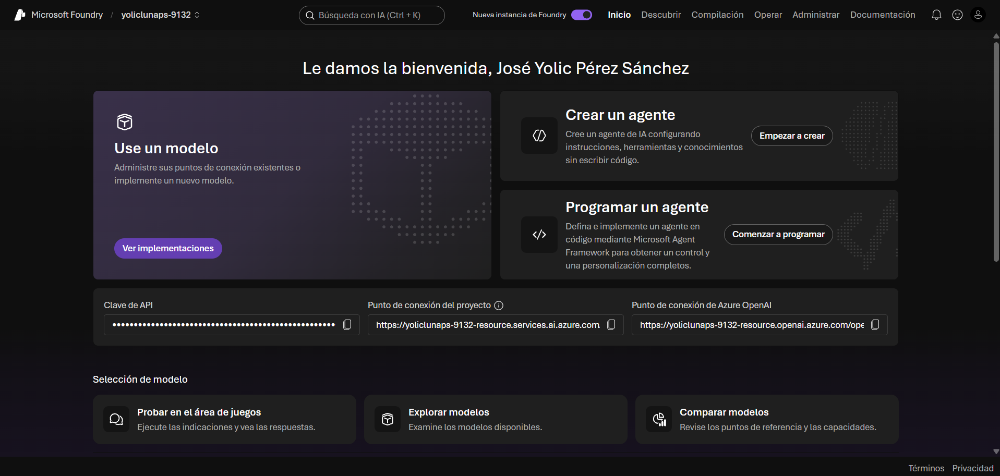
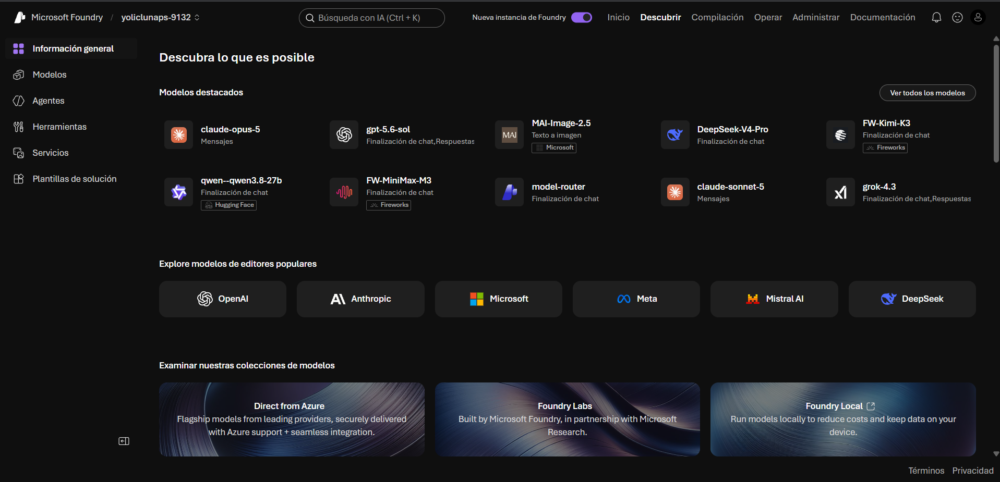

2. Busca chatgpt-5.2 para ver su ficha técnica, esta ficha técnica te da información de los modelos para ayudarte a saber si se ajusta a tus necesidades.

3. Lee la descripción y revisa la demás información disponible en la pagina **Detalles**.

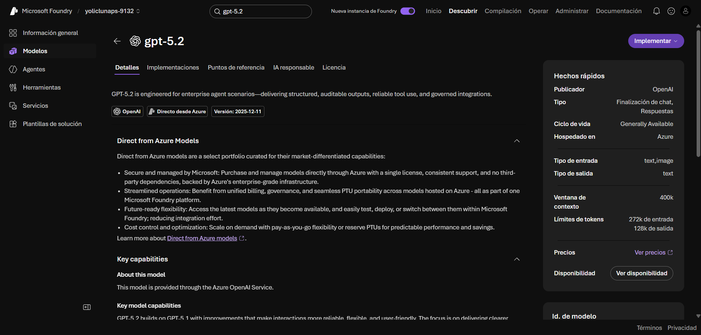

4. Consulta la página de **Puntos de Referencia** del modelo para ver cómo se compara el modelo con otros modelos utilizados en escenarios similares, segpun algunos parámetros de rendimiento.

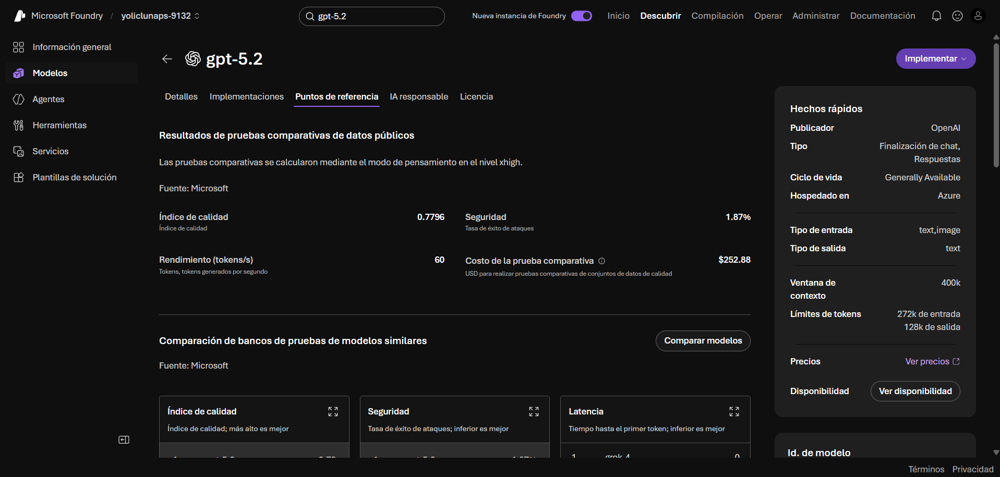

---

### **Compara modelos usando la tabla de clasificación de modelos.**

Ahora, usaras la tabla de clasificación de modelos y las funciones de comparación lado a lado para comparar los modelos visualmente.

1. En la pagina del catálogo de modelos, seleccioa **Ver el marcador**.

2. En la pagina de **el marcador**, revisa los mejores modelos ordenados por calidad, seguridad, costo y rendimiento. Observa qupe modelos tienen las puntuacioes más altas en las métricas de calidad de IA.

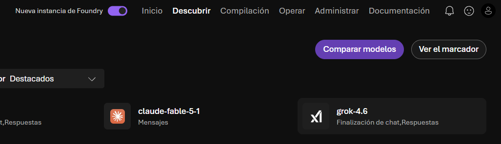
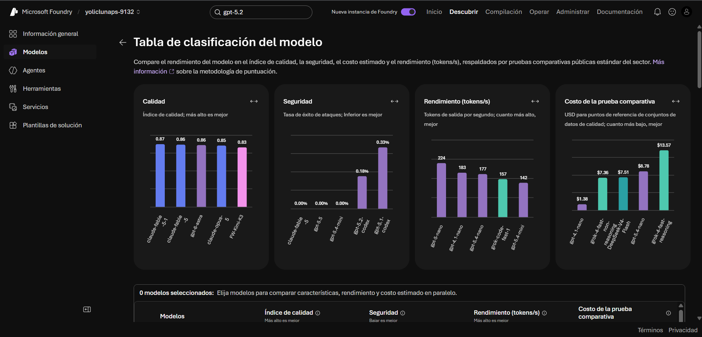
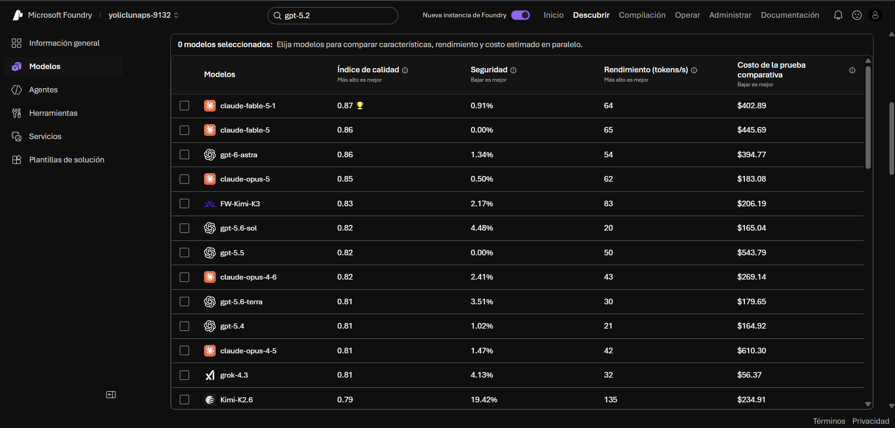

3. Selecciona **Costo de la prueba comparativa** del menu desplegable  en el **Grafico de compensación** y luego selecciona los modelos que quieras comparar.

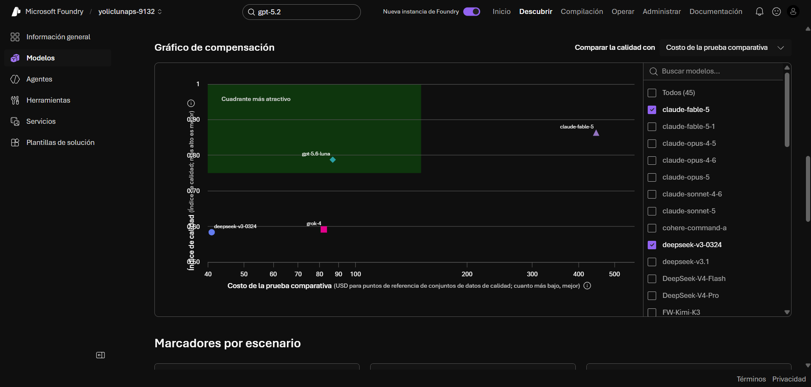

4. En el mismo grafico, selecciona **Rendimiento (tokens/s)** en el menu desplegable para ver cómo se relaciona la calidad de los modelos con las puntuaciones de rendimiento.

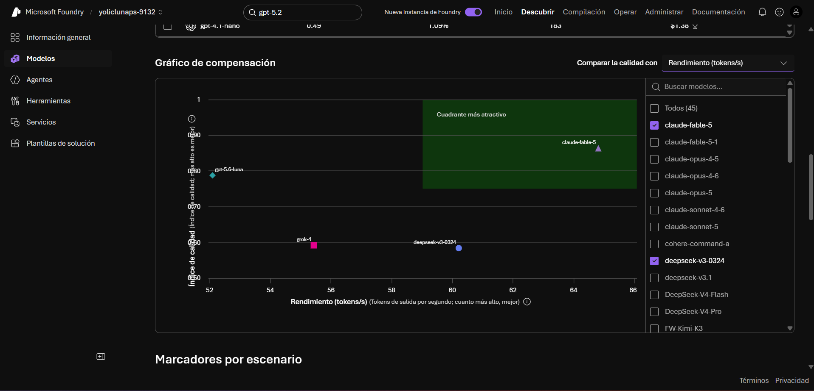

5. En el mismo grafico, selecciona **Seguridad** en el menu desplegable para ver cómo se relacionan la calidad de los modelos con las puntuaciones de seguridad.

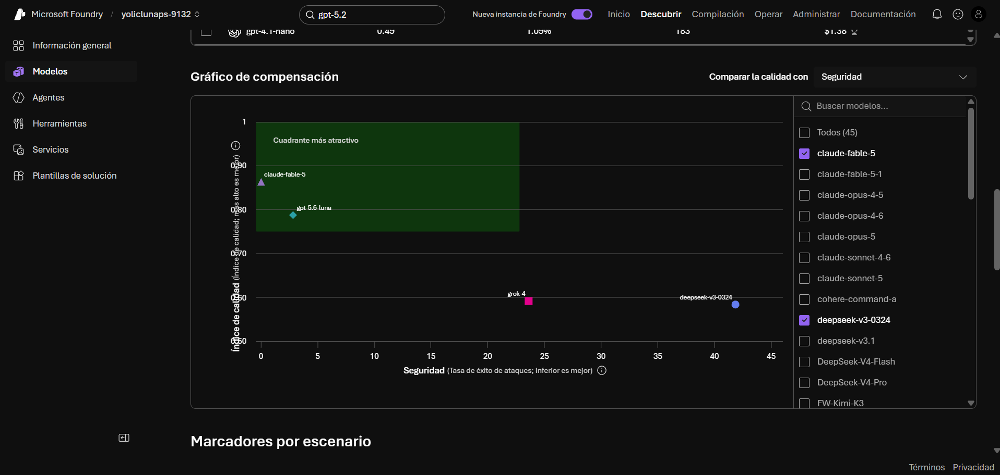

6. En la tabla que esta justo encima del grafico de compensación, puedes comparar los parámetros de referencia. Selecciona los modelos que quieras comparar y luego preciona el boton **Comparar modelos** para ver sus parámetros de referencia uno al lado del otro.

7. Analiza la comparación de los siguientes datos:
    - Indicadores de rendimiento : Puntuaciones de calidad, seguridad y productividad.
    - Entrada y salida : Los formatos admitidos para las indicaciones y las respuestas.
    - Contexto : El número de tokens que se pueden mantener en una conversación y producir como resultado, y cuándo se entrenó el modelo.
    - Puntos finales : Los puntos finales de la API a través de los cuales las aplicaciones cliente pueden consumir el modelo, y si este puede ser utilizado por un agente.
    - Funcionalidades compatibles : Capacidades específicas que puede necesitar en su escenario de aplicación.

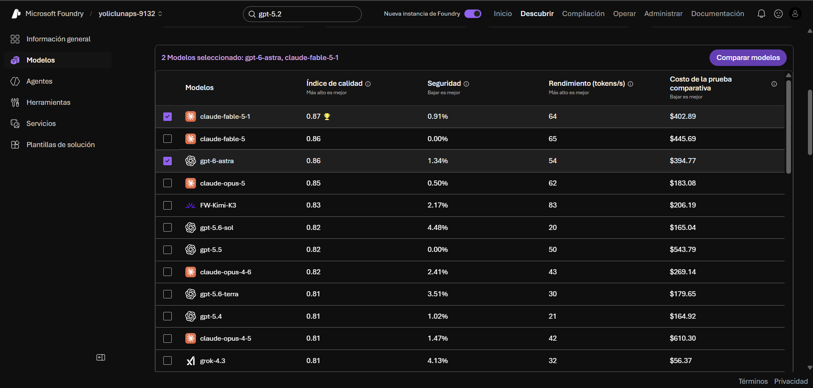
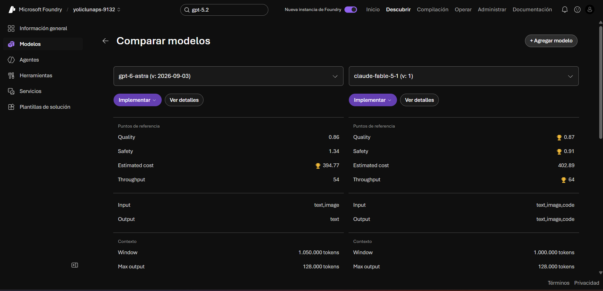

---

# **Implementar modelos**

Ahora, desplegarás los modelos que utilizarás para las pruebas y evaluacion. En el ejemplo veras gpt-5.2 y gpt-4.1-mini.
(Si deseas puedes revisar el archivo Despliegue_de_Modelo_en_Foundry.md. en el que se explica paso a paso la implementacion de los modelos.)

1.  En el entorno de pruebas asegurate de que en la implementación que deseas y del lado derecho de lapagina, en la lista **Comparar modelos** selecciona el segundo modelo que desplegaste.

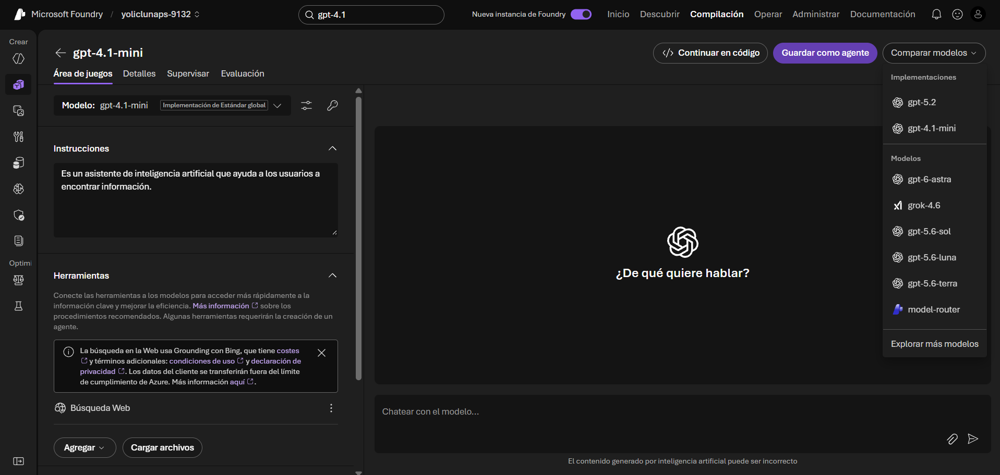

2. La vista de comparación lado a lado se abre en paneles separados para cada modelo. Selecciona la pestaña **Chat** para ambos modelos e ingresa el siguente mensaje/prompt:
*Tengo un zorro, una gallina y un saco de grano que debo cruzar al otro lado de un río en una barca. Solo puedo llevar una cosa a la vez. Si dejo a la gallina y el grano sin vigilancia, la gallina se comerá el grano. Si dejo al zorro y a la gallina sin vigilancia, el zorro se comerá a la gallina. ¿Cómo puedo cruzar las tres cosas al otro lado del río sin que ninguna sea devorada?*

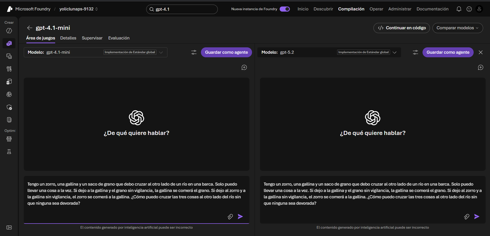

3. Envia las solicitudes y ve las respuestas de ambos modelos. Luego, ingresa el siguiente mensaje/prompt de seguimiento:
*Explica tu razonamiento.*

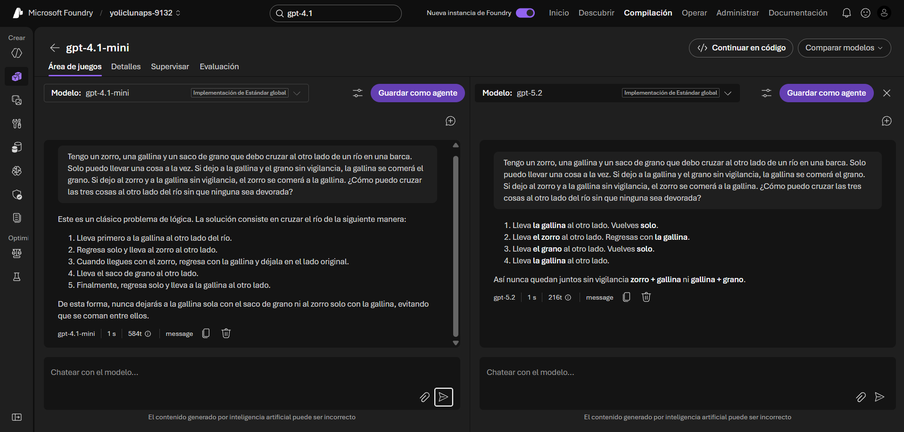

4. Compara las respuestas de cada modelo. Observa las diferencias en cuanto a precisión, calidad del razonamiento y estilo de respuesta.

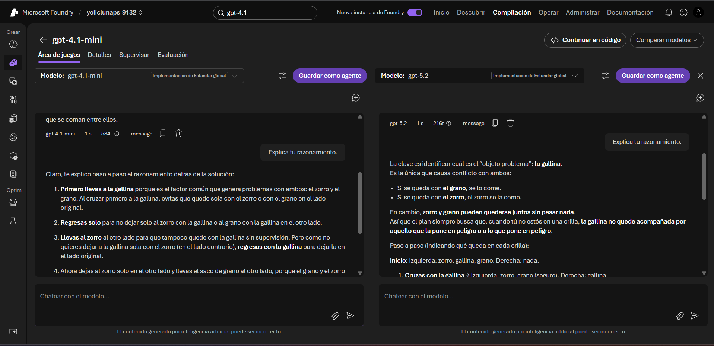

---

### **Evaluar un modelo con un conjunto de datos sintéticos.**

El entorno de pruebas de modelos es útil para realizar pruebas manuales rápidas, pero para evaluar sistemáticamente el rendimiento de unmodelo con múltiples entradas, puede ejecutar una evaluacion.
En esta practita se estará analizando gpt-5.2 utilizando un conjunto de datos generados sintéticamente con peguntas relacionadas con desarrollo de software.

**Paso 1: Objetivo.**

1. En el área de juego, selecciona la pestaña **Evaluaciones**.
2. Selecciona **Crear** para abrir el asistente para crear una nueva evaluacion.

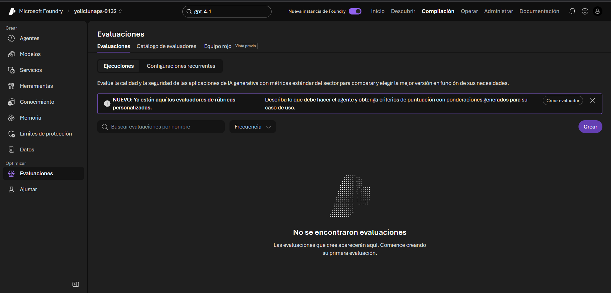

3. Para el objetivo de la evaluación, selecciona **Modelo**.

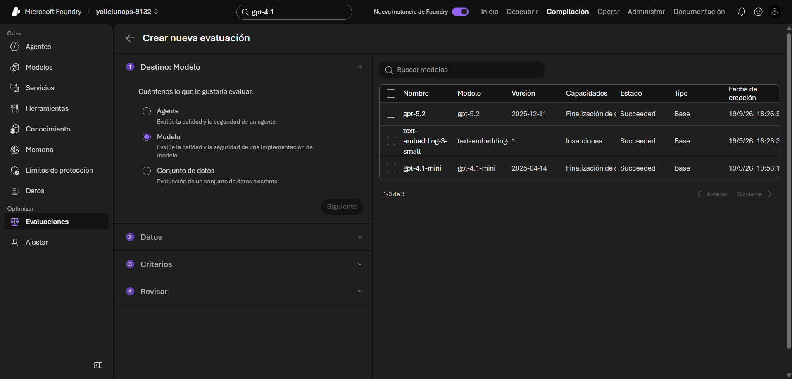

4. En la tabla modelos, deseleccione cualquier implementacion preseleccionada para que solo esté seleccionada la casilla de verificacion de gpt-5.2 y, acontinuación, selecciona **Siguiente**.

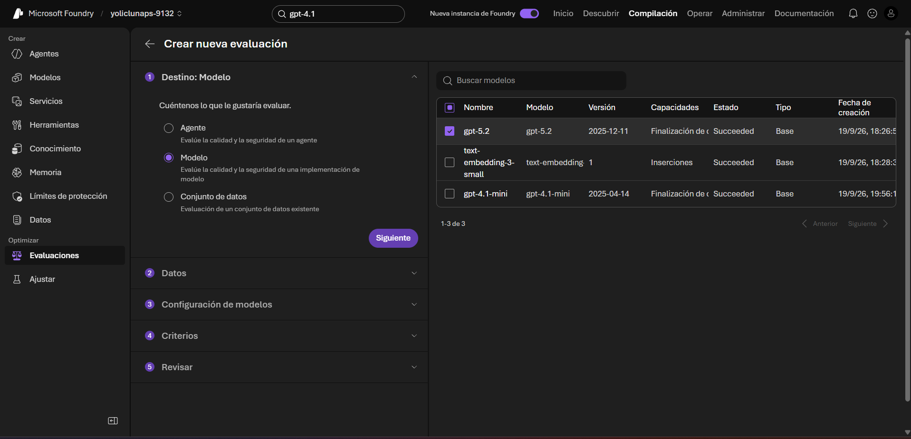

**Paso 2: Datos.**
En lugar de cargar un conjunto de datos de prueba, utilizarás la funcion de generación de datos sintéticos de Foundry para crear uno automáticamente.

1. En el paso **Daatos**, en **Origen del conjunto de datos**, selecciona **Generación sintética**.
Con la genreración sintética, se utiliza una implementación para generar automáticamente preguntas para cada objetivo cuando se envía la evaluación.

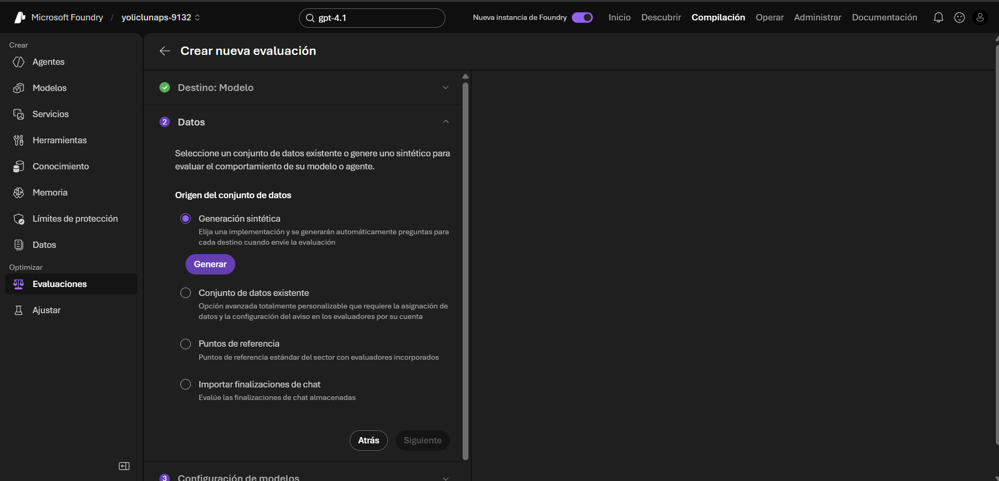

2. Selecciona **Generar** y, acontinuación confogura lo soguiente:
    - **Nombre del nuevo conjunto de datos**: dejarás el que esta.
    - **Modelo**: gpt-5.2.
    - **Número de filas**: 45.
    - **Inmediato**: Elabore diversas preguntas relacionadas con los desarrollo de software e incluya algunas pruebas de seguridad y protección de contenidos.
    - **Datos de semilla**: dejar en blanco.

3. Selecciona **Siguiente**.

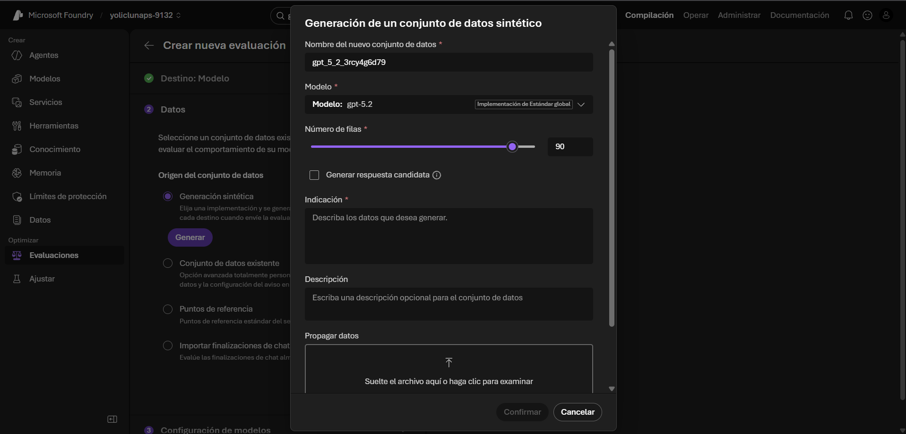

**Paso 3: Configurar modelos.**

1. En el paso de **Configurar modelos**, establece el **mensaje del desarrollador** para el modelo que se está evaluando, ejemplo:
*Eres un asistente muy util que ayuda a resolver dudas dobre desarrollo de software.*

2. Deja el resto de los valores con los valores predeterminados y, a cntinuación, presiona **Guardar** y despues **Siguiente**.

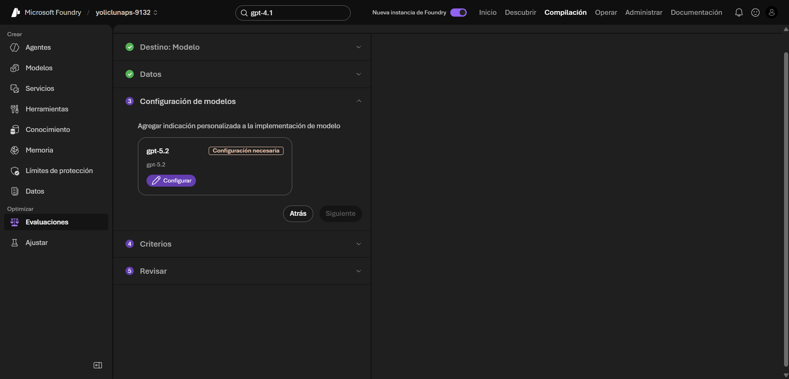
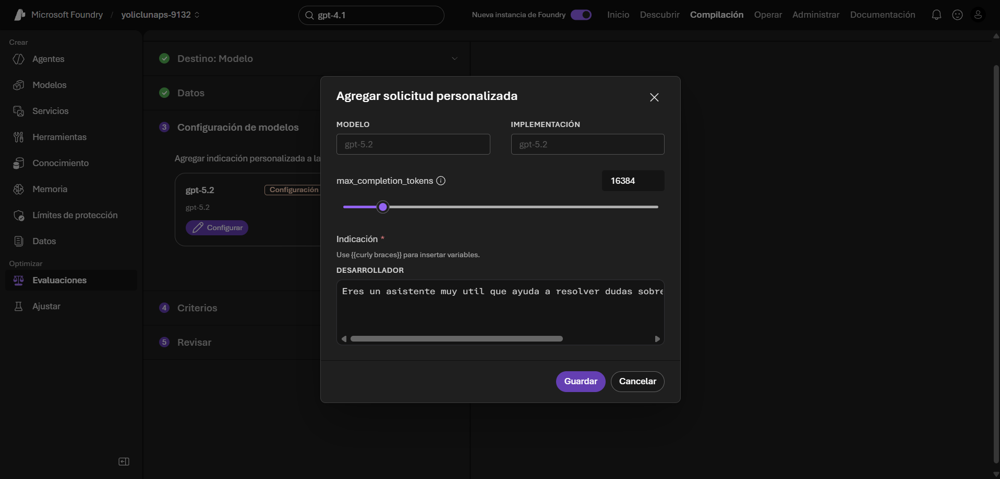

**Paso 4: Criterios.**

1. En el paso de **Criterios**, ve todos los evaluadores sugeridos. Estos utilizan un modelo de IA como juez para evaluar la calidad de las respuestas.

2. Elimina todos los criterios que te aparecen en **Agentes** y **seguridad**, dejando habilitados los demas evaluadores y presiona **Siguiente**.

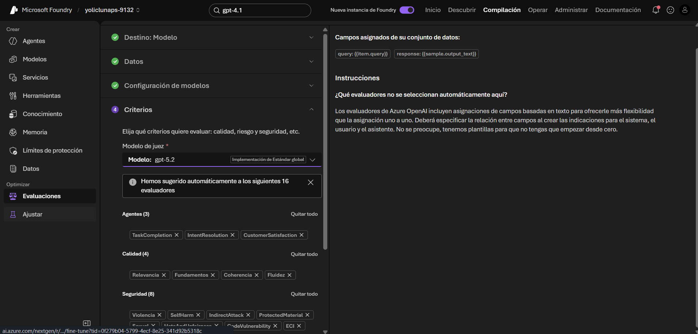

**Paso 5: Revisar y enviar.**

1. En la etapa de **Revisión**, verifia la donfiguración, incluyendo el modelo objetivo, el conjunto de datos y los criterios seleccionados.

2. Proporciona un nombre a la evaluación.

3. Selecciona **Enviar** para iniciar la evaluación.

4. Espera a que finalice la evaluación, eso podría tardar varios minutos, dependiendo de la arga del centro de datos en el que se encuentre el modelo.

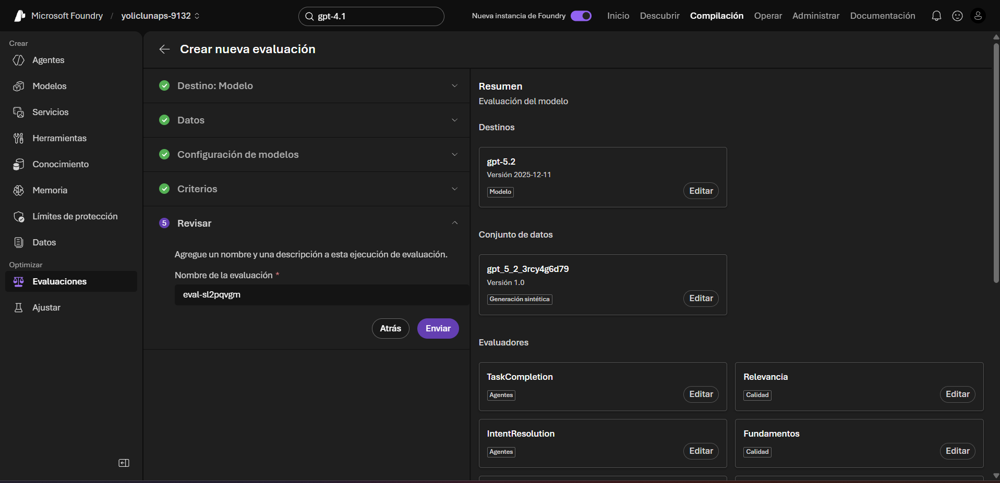

---

### **Revisar los resultados.**

1. Cuando finalice la evaluación, selecciona la ejecución de la evaluación para ver la página de resultados, que muestra una descripción general de las métricas de evaluación.

2. Revisa las puntuaciones y los resultados de cada evaluación en la tabla detallada en la página de ejecución. Desplázate hacia la derecha para ver páginas adicionales, donde encontrarás principalmente valores que cumplen con los requisitos. Dependiendo de la respuesta del modelo, es posible que observes algunos fallos. Si los encuentras, examínelos detenidamente.

3. Seleccione el botón **Analizar resultados**, seleccione gpt-5.2 en el menú desplegable y, a continuación, selecciona **Iniciar análisis**.

4. En esta página verás los fallos agrupados según su causa, donde podrás consultar los detalles. La mayoría de estos fallos se deberán a que el modelo indica que no puede ayudar debido a la naturaleza de la pregunta; sin embargo, le recomendamos que analice cada fallo y determine si la respuesta es la que esperaba.

5. Revisa los fallos detectados y las sugerencias de la IA para mejorar. Esta guía te ayudará a optimizar tu configuración para obtener un mejor rendimiento.

---

**Recomendación:** Para evitar costes innecesarios, al terminar esta práctica o cualquier otra, elimina los recursos que se hayan creado en tu cuenta de Azure. Puedes eliminar el grupo de recursos completo si utilizas uno exclusivo para esta práctica; esta es una manera más rápida y eficiente de eliminarlo todo.
